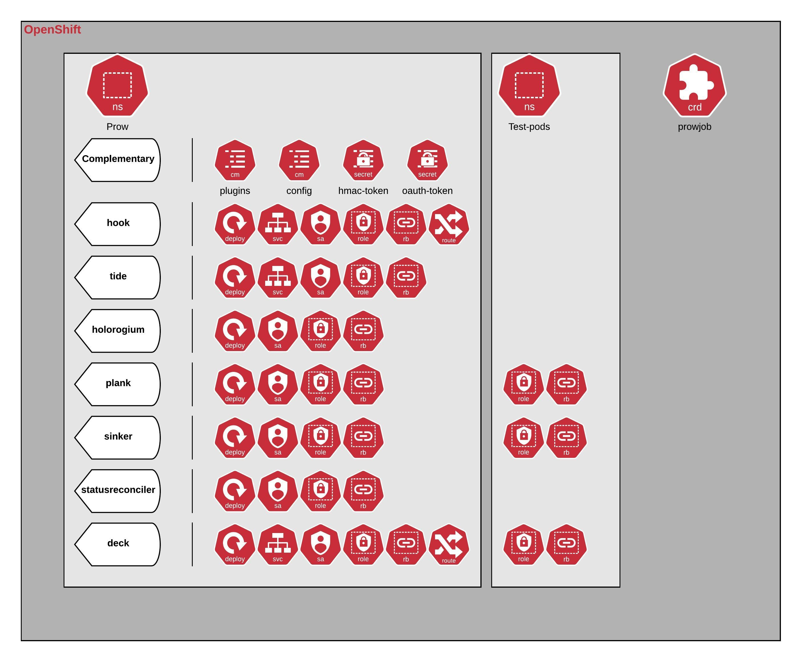

# openshift-prow-demo

This repository is used to document the steps I've taken in order to deploy Prow onto OpenShift 4

## Getting started

All the steps were done following this [guide](https://github.com/kubernetes/test-infra/blob/master/prow/getting_started_deploy.md), adapting it to use _OCP4_ and avoiding using additional tools such as _bezel_.

### Prerequisites

Before installing the application in your OCP instance, makes sure you have all the necessary tools and resources.

 - Running OCP instance
 - oc client
 - helm client
 
 - Two namespaces created (do not forget to replace its values in [values.yaml](./prow-chart/values.yaml))
 - hmac secret created.
    ```
   openssl rand -hex 20 -out hmac-token
   oc create secret generic hmac-token --from-file=hmac=hmac-token
   ```
 - Github oauth secret created.
    ```
    Create oauth token on github
    oc create secret generic oauth-token --from-file=oauth=oauth-token
    ```

### Install
```
helm install prow prow-char
```

Below you can find a diagram depicting all the resources created by running the helm chart in this repository against your OCP cluster.



Resources were provisioned according to this [yaml file](https://github.com/kubernetes/test-infra/blob/master/config/prow/cluster/starter.yaml) from the official github page (see references).
  
## Errors encountered

In this section, you can find a list of some errors I faced while deploying and configuring prow.

 - **Fetching bot account name from github**
 
``` json
{
    "component":"tide",
    "error":"error getting bot name: fetching bot name from GitHub: status code 401 not one of [200], 
    body: {\"message\":\"Bad credentials\",
        \"documentation_url\":\"https://developer.github.com/v3\"}",
    "file":"prow/cmd/tide/main.go:152",
    "func":"main.main",
    "level":"fatal",
    "msg":"Error getting Git client.",
    "time":"2020-05-19T15:31:21Z"
}
```
   Solution/Workaround: Recreated oauth token on github


  - **echo-test pods all failing**

    `description: 'Job cannot be started: pods is forbidden: User "system:serviceaccount:prow:plank"
     cannot create resource "pods" in API group "" in the namespace "test-pods"'`
     
     Solution/Workaround: Some roles were being created referencing "default" namespace. 
     
  - **Pull requests created in github aren't triggering prowjobs**
  
     With the following configured jobs, unable to see any jobs running in deck.
     
     ``` yaml
    presubmits:
      hxia209/openshift-prow-demo:
      - name: test-presubmit
        decorate: true
        always_run: true
        skip_report: true
        spec:
          containers:
          - image: alpine
            command: ["/bin/printenv"]
    postsubmits:
      hxia209/openshift-prow-demo:
      - name: test-postsubmit
        decorate: true
        spec:
          containers:
          - image: alpine
            command: ["/bin/printenv"]
     ```


## References

  - Github page: https://github.com/kubernetes/test-infra/tree/master/prow
  - Documentation: https://jenkins-x.io/docs/reference/components/prow/
  - List of internal plugins: https://github.com/jenkins-x/test-infra/blob/master/prow/hook/plugins.go
  - Medium article 1: https://medium.com/@jdrawlings/serverless-jenkins-with-jenkins-x-9134cbfe6870
  - Medium article 2: https://medium.com/@vbehar/jenkins-x-pipelines-internals-part-1-from-github-webhook-event-to-tekton-pipeline-6927c6eb879c
